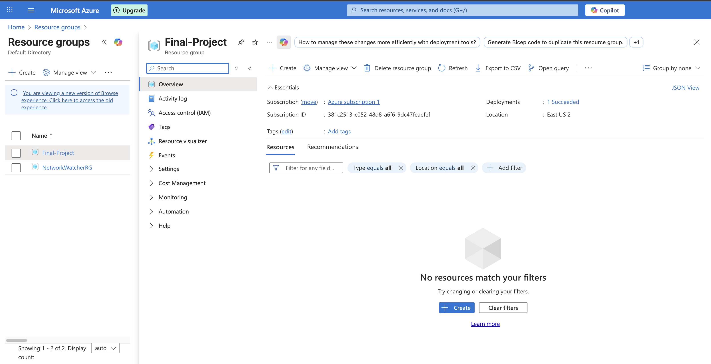
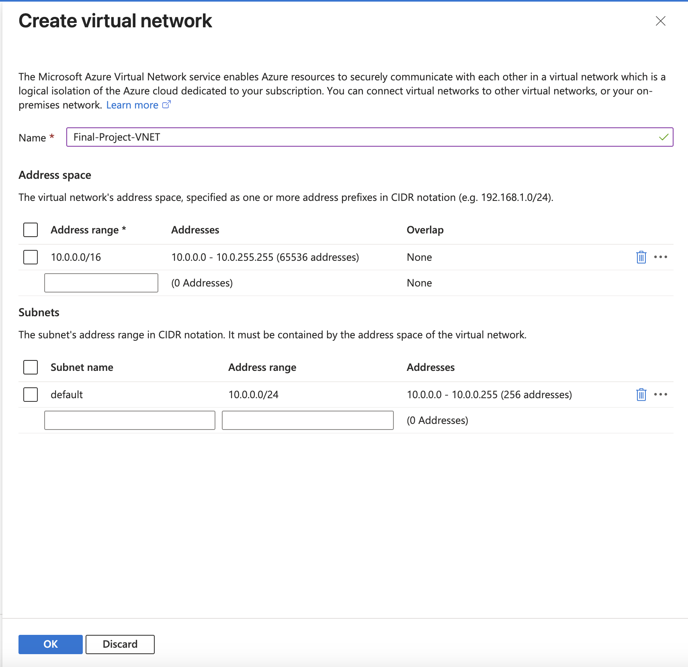
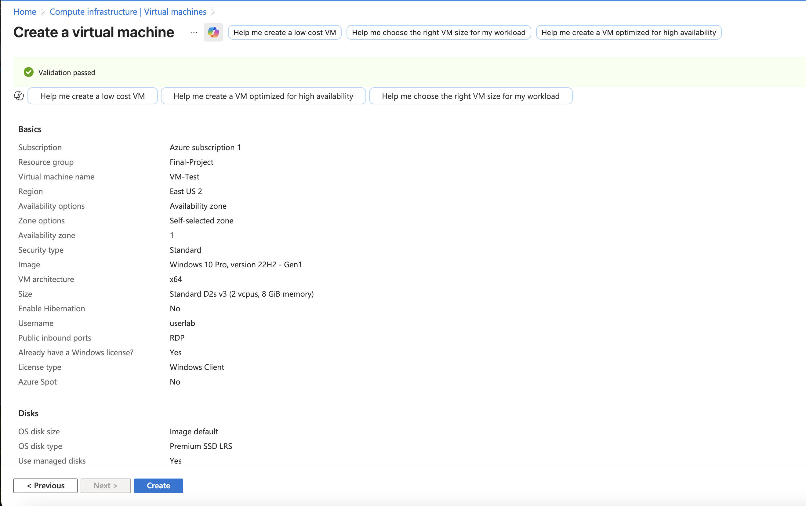
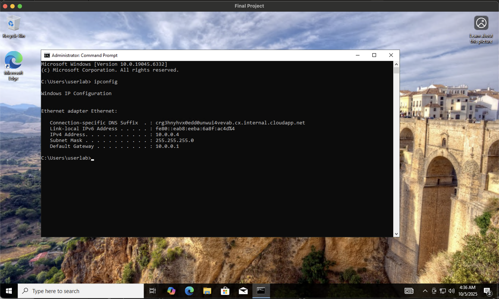

# Azure Virtual Machine Deployment and Network Connectivity Test

## Project Summary
This project demonstrates the deployment of a Windows 10 Virtual Machine in Microsoft Azure and the validation of its connectivity through Remote Desktop Protocol (RDP) and network diagnostic commands such as `ipconfig` and `ping`.

The goal is to showcase practical skills in setting up cloud infrastructure, configuring secure remote access, and confirming system functionality through network testing. This hands-on project highlights foundational cloud engineering and troubleshooting techniques relevant to IT and DevOps roles.

---

## Languages and Tools Used
- Microsoft Azure
- Windows 10 VM
- Remote Desktop Protocol (RDP)
- PowerShell / Command Prompt

---

## Environments
- Azure Cloud Environment
- Windows 10 Virtual Machine

---

## Steps Demonstrated
1. Resource Group creation in Azure  
2. Virtual Network creation and configuration  
3. Virtual Machine validation before deployment  
4. Virtual Machine deployment confirmation  
5. VM Overview with Public IP address  
6. Remote Desktop Protocol (RDP) setup  
7. RDP connection to Virtual Machine  
8. Network configuration test using `ipconfig`  
9. Connectivity test using `ping 8.8.8.8 -n 4`

## Screenshots

### 1. Azure Resource Group Overview
  
*Shows the newly created resource group in the Azure portal, confirming successful deployment and region settings.*

### 2. Virtual Network Overview
  
*Displays the address range and subnet configuration for the new virtual network.*

### 3. VM Validation
  
*Shows successful validation of virtual machine settings before deployment (region, image, size, and credentials).*

### 4. VM Deployment
  
*Confirms the virtual machine deployment was completed successfully with its assigned configuration.*

### 5. VM Overview with Public Address
  
*Displays the VM overview page, including the assigned public IP used for RDP connectivity.*

### 6. RDP Setup
  
*Shows configuration of Remote Desktop Protocol (RDP) settings and security warning prior to login.*

### 7. RDP Connection to VM
  
*Confirms a successful RDP session to the virtual machine, proving external connectivity.*

### 8. IP Configuration Output
  
*Displays results of the `ipconfig` command showing IPv4, subnet mask, and default gateway.*

### 9. Ping Test (8.8.8.8 -n 4)
  
*Demonstrates successful external connectivity with consistent ping replies to Google’s DNS.*

## Demonstration
This project illustrates how to:
- Deploy a Virtual Machine in Azure
- Connect securely using RDP
- Run basic network troubleshooting commands to confirm system functionality
