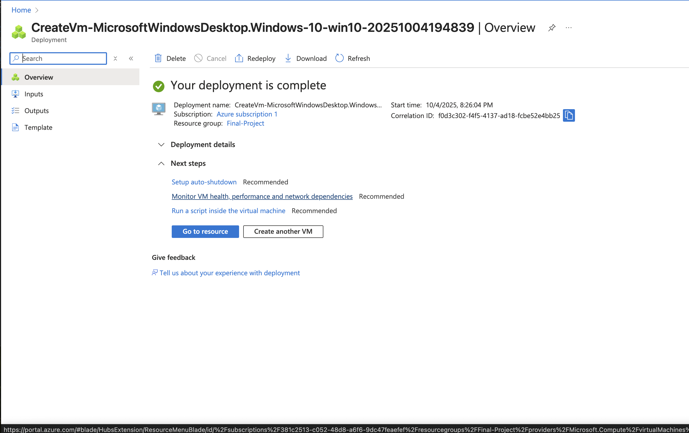
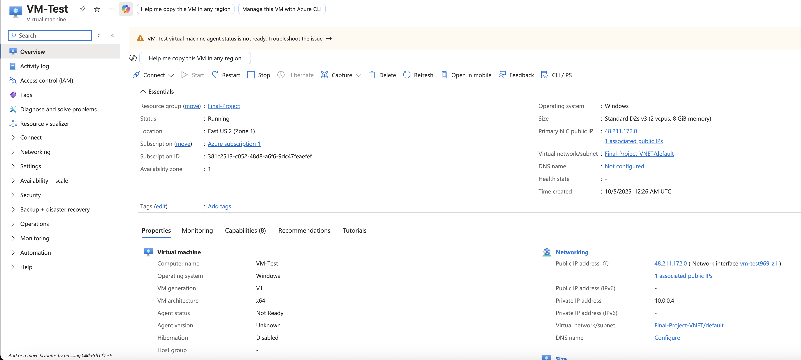

# Azure Virtual Machine Deployment and Network Connectivity Test

## Project Summary
This project demonstrates the deployment of a Windows 10 Virtual Machine in Microsoft Azure and the validation of its connectivity through Remote Desktop Protocol (RDP) and network diagnostic commands such as `ipconfig` and `ping`.

The goal is to showcase practical skills in setting up cloud infrastructure, configuring secure remote access, and confirming system functionality through network testing. This hands-on project highlights foundational cloud engineering and troubleshooting techniques relevant to IT and DevOps roles.

---

## Languages and Tools Used
- Microsoft Azure
- Windows 10 VM
- Remote Desktop Protocol (RDP)
- PowerShell / Command Prompt

---

## Environments
- Azure Cloud Environment
- Windows 10 Virtual Machine

---

## Steps Demonstrated
1. Resource Group creation in Azure  
2. Virtual Network creation and configuration  
3. Virtual Machine validation before deployment  
4. Virtual Machine deployment confirmation  
5. VM Overview with Public IP address  
6. Remote Desktop Protocol (RDP) setup  
7. RDP connection to Virtual Machine  
8. Network configuration test using `ipconfig`  
9. Connectivity test using `ping 8.8.8.8 -n 4`

## Screenshots

### 1. Azure Resource Group Overview
  
Shows the newly created resource group in the Azure portal, confirming successful deployment and location settings.

### 2. Virtual Network Overview
  
Displays the address range and subnet configuration for the new virtual network.

### 3. VM Validation
  
Validation passed prior to deployment (region, image, size, and credentials).

### 4. VM Deployment
  
Deployment completed successfully with assigned configuration.

### 5. VM Overview with Public Address
  
Displays the VM overview page showing the assigned Public IP for RDP.

### 6. RDP Setup

Shows configuration of Remote Desktop Protocol (RDP) settings and the security prompt prior to login.

### 7. RDP Connection to VM

Confirms a successful RDP session to the virtual machine, indicating external connectivity is working.

### 8. IP Configuration Output

Displays IP configuration details showing network adapter information within the virtual machine.

### 9. Ping Test (8.8.8.8 -n 4)

Validates external network connectivity using ICMP ping to Google’s DNS server (8.8.8.8) with four echo requests.

## Demonstration
This project illustrates how to:
- Deploy a Virtual Machine in Azure
- Connect securely using RDP
- Run basic network troubleshooting commands to confirm system functionality
